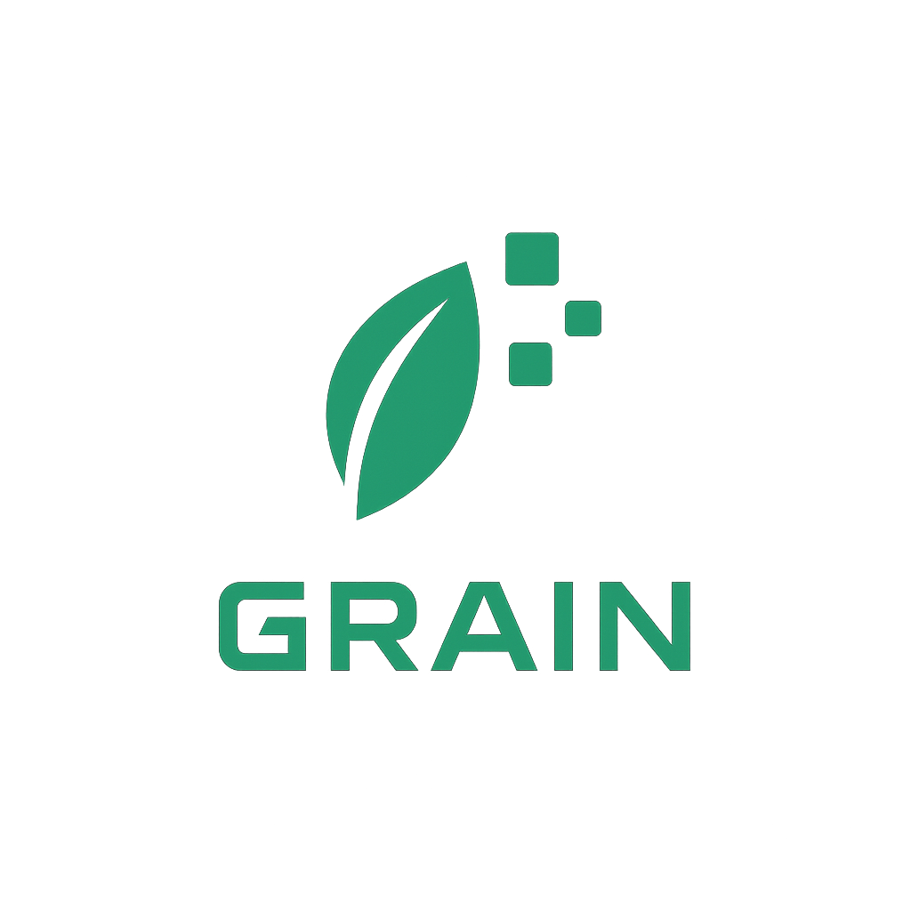

# PolicyMaking - GRAINAI 



> ⚠️ **Note:** This project is still under development.

AI-powered policy analysis and generation platform. Analyzes policy documents, identifies issues, and generates improved versions.

## Quick Start

**Requirements:** Docker & Docker Compose

```bash
git clone <repository-url>
cd PolicyMaking
docker compose up -d
```

Access:
- **Application:** http://localhost (via nginx reverse proxy)
- **Backend API:** http://localhost/api/
- **API Docs:** http://localhost/docs
- **OLLAMA Direct:** http://localhost:11434

## Services

| Service | Port | Tech | Purpose |
|---------|------|------|---------|
| Nginx | 80 | Nginx Alpine | Reverse proxy & load balancer |
| Frontend | Internal | React 18 + Tailwind | Web UI |
| Backend | Internal | FastAPI + Python 3.11 | API server |
| OLLAMA | 11434 | LLM Runtime | Language model inference |

## Project Structure

```
backend/          # FastAPI application
├── app/
│   ├── main.py
│   ├── routes/
│   ├── services/
│   └── utils/
└── requirements.txt

frontend/         # React application
├── src/
│   ├── components/
│   ├── App.js
│   └── api.js
└── package.json

terraform/        # Infrastructure as Code
ollama/           # LLM container
docker-compose.yml
```

## Development

### Backend
```bash
cd backend
python3.11 -m venv venv
source venv/bin/activate
pip install -r requirements.txt
uvicorn app.main:app --reload
```

### Frontend
```bash
cd frontend
npm install
npm start
```

## Common Commands

```bash
# Start all services with reverse proxy
docker compose up -d

# Stop services
docker compose down

# View logs
docker compose logs -f <service>

# Check status
docker compose ps

# View reverse proxy logs
docker compose logs -f nginx
```

## Architecture with Nginx Reverse Proxy

```
┌─────────────────────────────────┐
│   Client Browser (Port 80)       │
└────────────────┬────────────────┘
                 │
┌────────────────▼────────────────┐
│  Nginx Reverse Proxy (Port 80)   │
│  - Routes / → Frontend           │
│  - Routes /api/* → Backend       │
│  - Routes /docs → API Docs       │
└────────────────┬────────────────┘
        ┌────────┴────────┐
        │                 │
┌───────▼──────┐  ┌──────▼──────┐
│   Frontend   │  │   Backend    │
│   (React)    │  │  (FastAPI)   │
└──────────────┘  └──────┬───────┘
                         │
                  ┌──────▼──────┐
                  │   OLLAMA     │
                  │ (LLM Models) │
                  └──────────────┘
```

## Terraform Deployment

Deploy to cloud infrastructure (AWS, GCP, Azure):

```bash
cd terraform

# Initialize Terraform
terraform init

# Preview changes
terraform plan

# Deploy infrastructure
terraform apply

# View outputs
terraform output

# Destroy resources (if needed)
terraform destroy
```

## Troubleshooting

**Port already in use?**
```bash
lsof -i :3000  # Check frontend
lsof -i :8000  # Check backend
lsof -i :11434 # Check OLLAMA
```

**Container won't start?**
```bash
docker-compose logs <service>  # View errors
docker-compose down -v         # Clean and restart
docker-compose up -d
```

**OLLAMA not responding?**
```bash
curl http://localhost:11434/api/tags
docker-compose restart ollama
```

## Dependencies

**Backend:** fastapi, uvicorn, pydantic, ollama

**Frontend:** react, axios, tailwindcss, framer-motion

---

**Last Updated:** January 3, 2026
